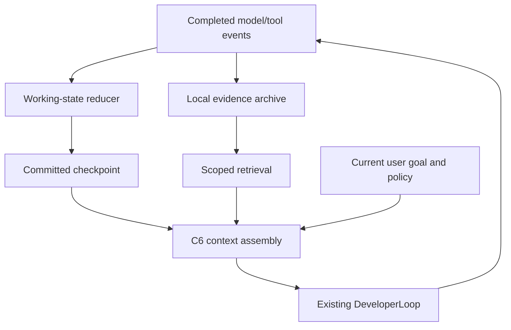

# Local Working Memory for Project Peritus

Implementation design · 5 September 2026 · Revision 0.2

Replaces the earlier provider-oriented proposal. Target: Project-Peritus, inspected at commit
`f7d96ebfdda30a060420b5210090eb8b50063cf3`.

## 1. The requested system

Add a local working-memory component to Peritus. It captures useful task state, keeps a compact
model of what the agent has learned, retrieves supporting observations, and rebuilds the next
prompt from that state. It survives compaction, provider changes, failed invocations, and process
restarts.

The component uses ordinary model messages and host tools. Storage, indexing, selection,
validation, and compaction policy run locally. There is no provider-managed conversation, opaque
reasoning dependency, remote memory service, embedding API, or server-side compaction endpoint.

The existing task model remains selectable through Peritus. If that model is remote, selected
context goes to it in its ordinary request. The memory component itself makes no remote calls.
Fully offline operation also requires a local task model and disabled remote provider failover.
An optional semantic compactor runs as a local subprocess with locally installed weights and
never falls back to a cloud model.

The goal is cumulative understanding: preserve observations, hypotheses, decisions, failures,
and plans so the agent can continue investigating. ARC Prize's Astra result motivates that goal;
this design recreates the useful behavior through explicit local state, without depending on its
private representation or promising its benchmark score. ARC Prize report

## 2. What Peritus already has

Extend the existing components rather than adding a second agent runtime.

| Existing component | Observed behavior | Proposed use |
|---|---|---|
| peritus-agent, developer/execution.rs | DeveloperLoop::run creates system/user messages, invokes the model, executes tools, records observations, and loops | Insert local memory around request assembly and completed tool batches |
| developer/semantic.rs | SemanticCompaction requests a plain-text checkpoint from the supplied provider | Replace this path in local mode with structured state and an optional local compactor |
| developer/context.rs | Compacts complete exchanges, normally retains eight recent messages, triggers at 85%, and records digest lineage | Reuse exchange grouping and accounting; improve pinning and replacement content |
| developer/types.rs | DeveloperTrace records observations and compaction metadata; successful outcomes return messages | Add an injected context port with durable state available on failure too |
| peritus-context | Provenance graph, budgets, checked compaction, visibility, and render plans | Own deterministic selection, validation, and rendering |
| peritus-memory | Scoped evidence-bearing records, lifecycle, rebuildable indexes, deterministic ranking | Reuse for reusable facts; add separate task-local working-state types |
| peritus-run-knowledge | Candidate/role-bound sections; navigation summaries have no evidence authority | Provide filtered writer/fixer/reviewer handoffs |
| Product turn.rs, turn/provider.rs | Builds fresh invocation requests and retries or switches provider | Reopen the same task memory across invocations |
| Product trace.rs | Durable framed provider/tool/retry records and compaction hashes | Add exact checkpoint-artifact references and stable source addressing |

Source links are pinned in Section 14. Findings are specific to the inspected production path;
they do not assert that all other paths lack persistence.

### Concrete gaps

The production loop uses its task provider for semantic compaction. Local mode must bypass that
additional provider call.

DeveloperLoopRequest has no resume input; run initializes a fresh two-message vector. Returned
DeveloperLoopOutcome.messages exists only on success.

The compaction trace entry contains hashes and counts, not a self-contained loadable checkpoint.
Persist exact replacement artifacts and a reconstruction manifest.

Semantic state should update as discoveries occur, before the context threshold is reached.

Prefix previews are insufficient for diagnostics in the middle of an output or a subtle failed
approach. Preserve structured facts and source references before reducing transcript detail.

## 3. Integration choice and ownership

Implement an in-process component behind an explicit Rust port supplied by the product host.
Keep pure types/reducers in C6 and effects in the host adapter. No new daemon, network service, or
mandatory inference process is needed.

The plugin SDK supports out-of-process plugins, but the inspected material does not establish a
plugin hook that replaces DeveloperLoop context assembly. This therefore requires a small source
integration; it is not an already-installable plugin manifest. A future sidecar can implement
the same port.

peritus-harness manages harness definitions and materialization. The execution hook for this
feature is in peritus-agent.



C6 owns bounded state, ranking, validation, and rendering, with no ambient file/network I/O.

D0 owns when the loop records, checkpoints, assembles, and resumes.

G4 supplies storage and optional local-compactor implementations and binds them to a run,
workspace, task, and role.

C0 supplies existing journal/artifact facilities through that adapter. Avoid a parallel memory
database.

Existing authorization, effect receipts, budgets, repository grounding, and acceptance gates
remain authoritative.

## 4. Three local memory layers

### Exact episodic archive

Preserve authorized model-visible messages and complete tool observations as locally addressable
artifacts. Retain original observations before model-visible output limiting. Record roles, tool
call/result associations, source binding, workspace revision, and sequence.

Assign stable handles such as obs:000184, mapped to an exact artifact digest and optional byte
range. Expose handles in result metadata so the agent can cite them. Reuse references to
already-persisted outputs rather than duplicate large artifacts. Do not automatically send the
archive back to the model.

### Structured working state

Maintain current understanding as records: literal requirement references; files, symbols,
commands and other entities; observed state; hypotheses and counterevidence; decisions with
concise reasons; failed approaches; plan dependencies; pending operations; and a bounded glossary.

Task-local hypotheses are distinct from reusable long-term facts. Do not automatically turn them
into approved MemoryRecords. Promotion uses the existing scope and review lifecycle.

### Bounded prompt view

Compile working state, recent complete exchanges, and relevant evidence into ordinary C5
messages. Use separate C6 segments for instructions and non-authoritative memory. Compression
principally selects and renders a smaller view of stable records; summaries never become the
sole source of facts.

## 5. Proposed data contracts

The following names are proposed additions. Apply existing bounds, identity types, canonical
encodings, and revision conventions during implementation.

```text
WorkingState {
  binding, revision, through_event,
  requirements[], entries[], plan[], pending[], glossary[]
}

WorkingEntry {
  id, kind, status, bounded_text,
  supports[], contradicts[], depends_on[],
  validity_scope, supersedes?
}

LocalCheckpoint {
  schema_version, binding, generation, previous_checkpoint?, through_event,
  working_state_artifact, transcript_manifest, source_index_artifact,
  render_policy_digest, validation_artifact
}
```

The binding includes run, workspace identity, role, logical task, conversation revision, and
applicable existing revision bindings. Invocation IDs annotate events but do not determine the
key that locates continuing task memory. A provider switch must not create an empty memory
namespace.

Entry status distinguishes observations, agent assertions, hypotheses, contradictions,
superseded entries, and stale conclusions. Recording that a tool returned text does not establish
the truth of every claim in that text. Authority and independent gate acceptance cannot be
assigned by the model.

Validity can depend on file hashes, candidate identity, conversation revision, or observation
time. Changed files invalidate dependent conclusions; unrelated edits need not discard the whole
working model. With uncertain dependencies, require a fresh check.

Example of the intended information, using invented code investigation details:

```yaml
id: hypothesis-7
kind: hypothesis
status: open
text: "The stale result may come from the cache key omitting workspace revision."
supports: ["obs:000184"]
contradicts: []
depends_on: ["entity:query-cache"]
next_check: "Compare keys before and after changing one source file."
```

The goal is a useful investigation record, not a transcript of private reasoning.

## 6. Minimal loop API change

Add a new entry point and retain the existing one for compatibility:

```rust,ignore
impl DeveloperLoop {
    async fn run_with_context(
        provider: &dyn ModelProvider,
        request: DeveloperLoopRequest,
        tools: &mut dyn DeveloperToolExecutor,
        trace: &mut dyn DeveloperTrace,
        context: &mut dyn DeveloperContextPort,
    ) -> Result<DeveloperLoopOutcome, DeveloperLoopError>;
}

trait DeveloperContextPort: Send {
    fn open(&mut self, binding: WorkingBinding) -> Result<ResumeView>;
    fn observe(&mut self, event: LocalObservation) -> Result<CommittedObservation>;
    fn propose(&mut self, delta: WorkingDelta) -> Result<DeltaReceipt>;
    fn assemble(&mut self, request: AssemblyRequest) -> Result<ContextView>;
    fn checkpoint(&mut self, expected_generation: u64) -> Result<CheckpointId>;
    fn read(&self, query: EvidenceQuery) -> Result<EvidencePage>;
}
```

These signatures are schematic, not compiling implementations. ContextView contains messages,
source coverage, budget accounting, and checkpoint generation. Update exports in developer/mod.rs
and peritus-agent/src/lib.rs, then the relevant caller/test constructors.

The product host owns one memory instance per logical task and reopens role-scoped views across
successive invocations. Each accepted observation is durable, so an error return cannot discard
the only copy. Provider adapters continue receiving normal ModelRequests.

## 7. Producing useful memory locally

### Deterministic ingestion

After each completed tool observation, extract schema-supported facts: command, exit status,
affected paths, output reference, file digest, or operation handle. Index diagnostics and stable
identifiers; preserve unknown output as evidence. After assistant output, retain visible text and
proposed calls without marking proposals as completed work.

This path requires no model. Deterministic reducers can capture mechanical state reliably but
cannot infer all useful semantic relationships from arbitrary output.

### Agent-authored updates

Add two bounded host tools through a DeveloperToolExecutor decorator:

```text
context_update(base_revision, operations[]) -> revision or typed rejection
context_read(observation_ids[], query?, cursor?, max_bytes) -> evidence page
```

Updates carry conclusions, hypotheses, contradictions, decisions, and plan changes with source
handles. Validate references, scope, revision, dependency structure, and size. Do not accept
authority declarations or arbitrary file writes.

The task model uses these during ordinary work, without a separate cloud compaction request. A
short stable instruction asks it to record discoveries that change its plan, non-obvious
failures, and unfinished investigations. It need not write memory every turn. If it ignores the
tool, deterministic ingestion and the archive still work; measure the resulting continuity gap.

The decorator forwards required_tool_name, completion_blocker, and take_progress_feedback to the
underlying executor. Memory tools cannot satisfy repository grounding or acceptance gates. Count
their calls against bounded budgets and track them separately. Do not require a different
terminal JSON format from the writer/reviewer.

### Optional local semantic compactor

An explicitly configured local subprocess may propose working-state deltas from bounded events
plus existing state. Run through existing process/sandbox boundaries with no credentials, no
tools, no network, fixed input/output limits, and a deadline. Weights must already be installed;
do not auto-download them.

Its proposals undergo the same validation as agent updates. Missing weights, malformed output,
or timeout selects deterministic assembly, never remote fallback. Default to deterministic
processing plus agent-authored updates; local auxiliary inference is optional.

## 8. Context assembly and compaction

In local mode, bypass SemanticCompaction::prepare and the subsequent provider SemanticCompaction
turn in developer/execution.rs. Keep legacy behavior selectable for migration and comparison,
not as an implicit fallback.

The current candidate selector protects the initial two messages by position. Replace positional
protection with semantic pinning: current user corrections, literal requirements, protected
policy, and unresolved protocol items stay pinned wherever they occur. Reuse complete
tool-exchange grouping.

The C6 compaction validator rejects protected sources and incompatible context classes.
Partition material by compatible class and visibility before proposing replacements. Do not
collapse a mixed conversation into a single allegedly equivalent evidence node.

Assembly algorithm:

1. Load committed state and replay its uncovered event suffix.
2. Refresh user and workspace bindings; invalidate stale dependent entries.
3. Pin current instructions, literal requirements, corrections, and pending operation state.
4. Add bounded working state: relevant conclusions, hypotheses, failed approaches, and next steps.
5. Add recent complete assistant/tool exchanges. Start with the existing eight-message preference but respect complete call/result boundaries.
6. Retrieve older evidence by handle, path, entity, diagnostic, and dependency.
7. Estimate the complete request, including tools and delimiters; reduce optional detail until it fits.
8. Persist a newly replaced view and its manifest before installing it for the next model call.

Reuse existing C6/provider budget semantics. The current helper treats max_input_tokens as input
capacity; do not accidentally subtract output reservation twice by assuming it is a total
context-window size. Make the 85% trigger and eight-message preference configurable, keeping
those defaults for the first comparison.

Use existing deterministic memory ranking where records qualify. Its current feature matching
uses weighted keys/digests and scope, confidence, evidence, recency, and feedback. Add a local
lexical index for episodic context_read if needed. No remote embeddings are required.

Never build a new checkpoint solely by summarizing the previous summary. Render from structured
state and source-backed entries. Preserve unresolved contradictions and important failures even
when old. Coalesce repeated events while maintaining references to the original occurrences.

If pinned material alone cannot fit, return a capacity error or split the task. Do not silently
drop constraints. Removing text from the prompt does not delete its archived bytes; unresolved
hashes are explicitly reported as unavailable.

## 9. Durability and recovery

Implement storage with existing C0 journal/artifact facilities, supplied through the product
host. Put state under configured run storage outside the editable source checkout. The design
does not assume a new global directory or independent SQLite service.

| Object | Rule |
|---|---|
| Original observations | Persist and verify before memory references them |
| Observation events | Stable source locator and monotonic sequence |
| Working-state deltas | Canonical, base-revision checked, replayable |
| Checkpoint artifacts | Immutable exact state plus transcript/source manifests |
| Active checkpoint reference | Transactional publication after validation |
| Search indexes | Rebuildable projections |

Use a single owner per memory lineage. A background local compactor reads an immutable snapshot;
new events remain in a tail. Publish through the snapshot boundary without overwriting the tail,
or reject a stale candidate.

Extend trace records with checkpoint/artifact references through a versioned compatible format.
Existing compaction tag 3 remains readable. Old traces lacking exact checkpoint material cannot
be claimed to support exact restoration; reconstruct only what their retained events establish.

Avoid a cross-store exactly-once claim. Persist the existing observation trace, idempotently
ingest its identity into the memory journal, commit the memory update, and then expose the new
view. On restart, ingest committed trace entries after the last stored locator. Persist
invocation-start prompt and policy bindings too; provider envelopes alone are not a complete
prompt history.

The current compaction path mutates messages before recording its compaction event. The new path
prepares an immutable candidate, persists its exact replacement and manifest, then installs the
view. Persistence failure preserves the old view and stops forward progress.

Tool effects continue using existing effect recovery. A pending or unknown outcome stays pending
or unknown. Memory reconstruction never authorizes re-executing an operation.

Checkpoint roots must keep referenced artifacts reachable through garbage collection. Locally
configured run deletion removes checkpoints, events, and indexes under existing retention
policy. Apply the memory crate's no-secrets rule to extracted entries; use existing host
redaction/access policy for archived source material.

## 10. Retry, provider change, and role handoff

Load the context port before run_developer_invocation constructs its request. Keep the logical
memory handle in the parent run context so ProviderResolution::Retry and errors preserve it.

A provider change re-renders the explicit state against the new profile's limits. Retain raw
tool exchanges only if valid for the receiving protocol; otherwise present completed episodes
as non-authoritative evidence and keep the original exchanges locally.

Every fresh writer/fixer invocation still performs its required workspace grounding. Memory
chooses useful inspection targets but does not carry grounding credit forward.

Project reviewer views through existing role/run-knowledge rules. Give reviewers allowed
observations and requirement/evidence references, not automatic access to writer speculation.
Model-authored handoffs use navigation-only semantics; exact candidate evidence retains its
separate provenance and eligibility.

For a fully offline deployment, reject remote primary/failover profiles before generation.
Local memory operation itself does not depend on primary provider identity.

## 11. Proposed configuration

The original design proposed the following syntax. It is now implemented as documented in
`docs/local-working-memory.md`; the optional subprocess requires additional native configuration.

```toml
[context.local]
enabled = true
engine = "deterministic"
semantic_backend = "disabled"
trigger_percent = 85
retain_recent_messages = 8
working_state_max_tokens = 4096
retrieved_evidence_max_tokens = 4096
max_update_operations = 32
max_entry_bytes = 2048
max_read_bytes = 16384
checkpoint_every_completed_batch = true
```

These are initial tuning defaults. Reduce effective allocations for small model profiles. A
local_process semantic backend additionally requires an explicit executable, local model path,
resource envelope, and timeout. The component has no remote semantic-backend URL option.

Expose generation, archive size, active tokens, stale entries, pending operations, compaction
savings, retrieval counts, and local-compactor failures through existing trace/debug surfaces.
A context inspection command should show the exact next model-visible view and source
references. No automatic cloud sync or cross-task learning.

## 12. Implementation packages

| Work package | Main changes | Completion condition |
|---|---|---|
| Resume seam | Developer types, execution, exports, product invocation | State survives both success and error paths; old callers remain supported |
| Local state | C6 working-state types, ingestion, selection/rendering | Runs without auxiliary inference or network |
| Persistence | Host adapter, trace addressing, C0 artifacts/journal | Restart reconstructs committed state and uncovered suffix |
| Local compaction | New assembly path and semantic pinning | No provider compaction requests in local mode |
| Memory tools | Executor decorator and bounded schemas | Useful updates/readback without bypassing grounding or gates |
| Handoffs | Retry/failover binding and run-knowledge projection | Reuse across retries; correct role isolation |
| Optional compactor | Bounded local subprocess | Local failure yields local deterministic fallback |

Preserve canonical formats where possible. New durable variants require normal protocol
versioning, migrations, and compatibility fixtures. Check dependencies and module boundaries
against architecture.toml; keep effectful work outside Verus-only modules. Extend proofs for
bounded arithmetic, revision monotonicity, visibility, and replay correspondence where
applicable. Semantic truth is not established by structural proof.

The original sections specify the requested implementation. The implementation record below
distinguishes that original source inspection from the subsequently authorized code changes.

## 13. Verification and evaluation

Extend the existing compaction matrix, fake-provider/driver tests, product failover tests, and
focused crate checks.

Required cases:

- Preserve a discovered failure cause across several compactions and avoid repeating the unchanged failed approach.
- Retrieve a decisive diagnostic beyond the old preview limit by exact source handle.
- Preserve a user correction added after the first two messages and supersede the old requirement.
- Crash between trace persistence and memory ingestion; recover exactly one ingestion.
- Crash before checkpoint publication; retain the previous committed generation.
- Fail an invocation and switch provider; preserve state and reset grounding credit.
- Change a file after a passing check; invalidate the dependent conclusion.
- Reject malformed local-compactor output and recover from timeout without remote fallback.
- Reject cross-run/cross-role retrieval before rendering.
- Assert zero provider SemanticCompaction requests in local mode, with network denied and a fake primary provider.
- Preserve unresolved tool associations without redispatching effects.
- Keep forged instructions inside tool output non-authoritative.

Compare existing Peritus, deterministic local state, local state plus agent updates, and those
features plus local semantic compaction. Hold task model/version, reasoning effort, tools, and
budgets fixed. Include long tasks crossing context limits and interrupted invocations. Count
auxiliary inference, memory calls, disk use, and latency.

Measure completion, repeated failed actions, post-compaction evidence recall, recovery accuracy,
tokens, elapsed time, and total cost. Predeclare the acceptable completion non-regression margin
and use repeated paired runs with uncertainty estimates. The practical target is fewer repeated
investigations and more reliable continuation at acceptable total cost.

## 14. Pinned source references

The supplied revision contained the following reference labels, without URL targets. They are
preserved here; they do not constitute independently verified links to the cited commit.

- Developer execution loop
- Semantic compaction
- Deterministic compaction and thresholds
- Developer types and trace port
- Provider request construction
- C6 compaction validation
- Context rendering and memory selection
- Memory records and ranking
- Run-knowledge section kinds
- Product invocation and provider recovery
- Durable product trace
- Architecture policy

The original review was a targeted source inspection, not a build or exhaustive audit.
Its provenance is retained here; subsequent implementation and verification are recorded below.

## Implementation record — 5 September 2026

The user authorized saving this design and beginning implementation on a new branch while S9
continues. The branch is `feature/local-working-memory`, in the `local-working-memory` worktree,
based on `a819e58244175711eba1f9c8baaab8ac8b92357c`. The cited inspection revision `f7d96ebf` is
not present in this local object database. Production paths above were rechecked at the branch
base; this record does not change the provenance of the supplied design.

Delivery starts with the D0 context seam, with a host-owned port separate from the invocation
request. Tests exercise observation retention through error returns, complete output capture
before limiting, fresh grounding on another invocation, persistence-before-request ordering,
and exclusion of legacy semantic compaction. Subsequent increments supply C6 state and canonical
replay, C0-backed host storage, product binding, memory tools, role projections, configuration,
inspection, and the optional local subprocess. The shipped product is to enable local memory by
default and label the feature; the legacy mode remains explicitly selectable. Evaluation uses
a separately declared build and campaign after implementation.

The initial seam is not the completed local-memory feature or a claim of restart recovery. No
product caller switches to it until the durable host adapter and scope checks are implemented.

### First increment: D0 context seam

Implemented `DeveloperLoop::run_with_context`, exported `DeveloperContextPort`, and added local
observation and assembly inputs. Existing callers still use `run`. The initial port uses a
prebound host instance, with invocation input recording, ordered observation ingestion,
candidate assembly, and checkpoint publication. Concrete C6 bindings, checkpoint identities,
generation receipts, source locators, update/read contracts, and host persistence remain for
the following increments; the schematic API in Section 6 describes that intended destination.

The loop forwards complete tool observations after trace persistence but before output limiting,
records proposals before dispatch, records terminal messages and host corrections, and stops on
any context-port failure. It checks the candidate's complete input estimate before asking the
host to publish and installing the view. Local mode makes no legacy semantic-compaction calls.
The tests use an explicitly in-memory port, not a substitute production persistence adapter.

Verified first-increment checks:

- `cargo test --offline --locked -j 2 -p peritus-agent --all-targets --all-features`: 47 passed, including eight new local-context tests; final run within the network-denied sandbox.
- `cargo clippy --offline --locked -j 2 -p peritus-agent --all-targets --all-features -- -D warnings`: passed.
- `cargo fmt --all -- --check` and `git diff --check`: passed.
- `cargo xtask architecture-check`: passed, 82 packages and 3,519 source files.
- `cargo xtask docs-check`: passed, 145 documentation files.
- `RUSTDOCFLAGS='-D warnings' cargo doc --offline --locked -j 2 -p peritus-agent --all-features --no-deps`: passed.
- `cargo check --offline --locked -j 2 -p peritus-product-runner --all-targets --all-features`: passed for existing product callers.

Initial native dependency builds required access to the existing compiler cache; the sandbox's
read-only cache caused the initial build failures. No dependency or warning policy was changed.
Crosslink session initialization failed because its recorded readiness daemon was not running;
the root session database also failed to open. Tracking repair is outside this increment.

The next increment defines the bounded C6 working-state model before canonical replay and the
C0-backed host adapter. No new Verus proof claim is made for the D0 runtime seam.

### Second increment: bounded C6 working-state engine

Implemented the `peritus_context::working` module with provider/invocation-independent
run/workspace/task/role/conversation binding, immutable contiguous observation locators, and
bounded investigation entries. Exact observation duplicates are idempotent; conflicting handle
reuse and skipped archive sequences are rejected. Hosts remain responsible for persisting and
verifying artifact bytes and redacting content before supplying inputs.

Atomic, revision-checked deltas validate source existence, configured bounds, canonical order,
and acyclic dependency/supersession edges before returning a new state. Superseded records stay
retained. File, candidate, and conversation dependencies support conservative transitive
invalidation; unrelated files need not invalidate precisely bound conclusions. Staleness stays
sticky across reverts. Reactivation requires a supporting or contradicting observation newer
than the invalidation prefix, including repeated environment invalidation. These are structural
checks, not a claim that cited observations entail a model's conclusion. All entries remain
non-authoritative regardless of model-declared status.

Verified second-increment checks (two Cargo workers, isolated worktree target directory):

- `cargo test -p peritus-context -p peritus-agent --all-targets --all-features --locked --offline`: 89 passed, including 16 new working-state tests.
- `cargo clippy -p peritus-context -p peritus-agent --all-targets --all-features --locked --offline -- -D warnings`: passed.
- `cargo verus verify -p peritus-context --all-features --locked --offline --check-toolchain --fwd-verus-args-to roots -- --no-cheating --rlimit 20`: passed; context crate 380 verified, zero errors. Verus emits 20 non-Copy derived-Clone specification warnings, including existing types; this does not prove semantic evidence sufficiency or durable crash recovery.
- `cargo xtask architecture-check`: passed, 82 packages and 3,532 source files.
- `cargo xtask docs-check`, warning-denied context rustdoc, formatting, and whitespace checks: passed.

Next: canonical event/checkpoint encoding and deterministic replay, immutable checkpoint
contracts, and C0-backed host persistence. Then connect the D0 seam and product identity,
requirements/pending-operation state, memory tools, role projections, configuration and
inspection, optional local inference, and separately declared paired evaluation. In-memory
scope isolation and invalidation are tested; durable restart recovery and product-level role
isolation are not yet implemented or qualified. This remains an uncommitted feature increment,
not the completed local-memory feature, and does not modify the frozen S9 source or campaign.

### Integrated implementation

The later increments implement the complete runtime path: canonical C6 event/checkpoint replay,
C0 journal/artifact ownership and transactional publication, exact C5 message archives, source
indexes, trace-gap ingestion, product retry/failover ownership, validated memory tools, semantic
pinning, complete exchange selection, role projection, default-enabled configuration, offline
route admission, read-only inspection, and optional local subprocess proposals through C2/C3.
The earlier increment-only limitations above are historical checkpoints, not current feature
switches. The root S9 worktree remains unchanged.

The existing reviewer policy excludes derived memory. Reviewers therefore archive and retrieve
their own exact observations but reject working-entry updates/pages; no writer speculation is
reclassified to bypass this policy. Writer/fixer state remains separately scoped. Architect
invocations retain their existing design-loop context behavior.

Inspection reports the exact last published view and explicitly labels an uncovered event tail;
it does not compute an unpublished future view. Cross-store publication remains ordered, not
atomic across the trace and C0 store. Torn trace tails stop with a named repair requirement.
These are explicit operational boundaries, not silent recovery shortcuts.

The optional compactor requires an installed executable, one weights file, and native sandbox
resources. It receives bounded JSON and returns an ordinary validated context_update proposal.
Linux uses a private filesystem; Windows explicitly admits external read-only inputs. No
automatic model acquisition, network, credential access, raw execution, or remote fallback is
added. Invalid or unavailable local inference leaves deterministic state usable.

Regression coverage now includes repeated view reduction preserving a failure cause, exact
diagnostics beyond previews, late corrections, sticky invalidation, atomic update rejection,
trace-gap replay, reused provider call IDs, checkpoint publication failure, pending effects,
provider recovery, role isolation, forged metadata, readonly inspection, strict configuration,
local proposal failure, native Linux filesystem isolation, and Windows path/ACL contracts.
Runtime IO is not claimed as a Verus proof; structural verification and ordinary API checks
remain separate. Real-model paired quality/cost evaluation requires a separately declared
candidate and campaign after code delivery; no S9 result is inferred from these tests.

Current operator instructions and accepted configuration live in
`docs/local-working-memory.md`. Final delivery evidence belongs to the commit and draft PR;
passing an earlier increment's checks is not a substitute for checking the final diff.
